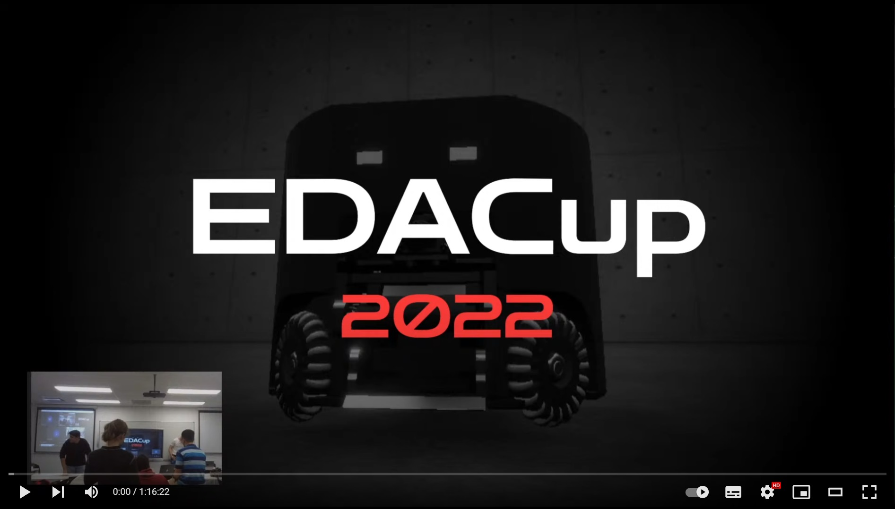

# EDACup 2023

Éste es el repositorio oficial de la competición de robótica virtual EDACup 2023.

Si no sabes qué es la EDACup, mira este vídeo de la final del año anterior:

* Si quieres participar en la competición, lee primero los [básicos sobre el manejo de los robots](BASICS.md).
* Si quieres clasificar, lee acerca del [proceso de clasificación](CLASIFICACION.md).
* Si quieres competir, lee acerca de la [competición EDACup 2023](COMPETICION.md).

¡Te esperamos victorioso!
