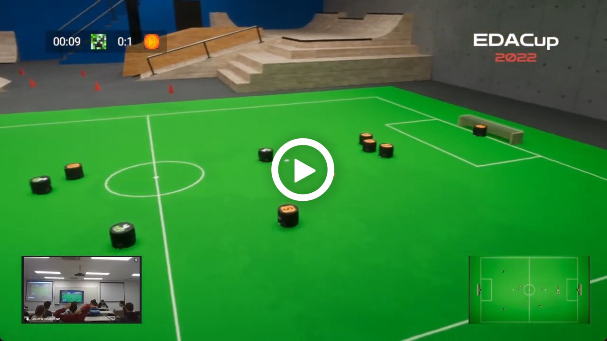

# EDACup 2023

¡Bienvenido a la competición de robótica virtual EDACup 2023!

Si no sabes qué es la EDACup, mira este vídeo de la final del año anterior:

## Factsheet

* La competición consiste en programar un equipo de robots autónomos.
* Está abierta a participantes de todo el mundo, sin importar su ubicación geográfica.
* Para participar en la competición, lee primero los [básicos sobre el manejo de robots](BASICS.md).
* La clasificación cierra el 17/4/2023 a las 23:59. Si quieres clasificar, lee acerca del [proceso de clasificación](CLASIFICACION.md).
* Los cuartos de final son el 10/6/2023; las semifinales y final, el 17/6/2023. Si quieres competir, lee acerca de la [competición EDACup 2023](COMPETICION.md).

¡Te esperamos victorioso!
