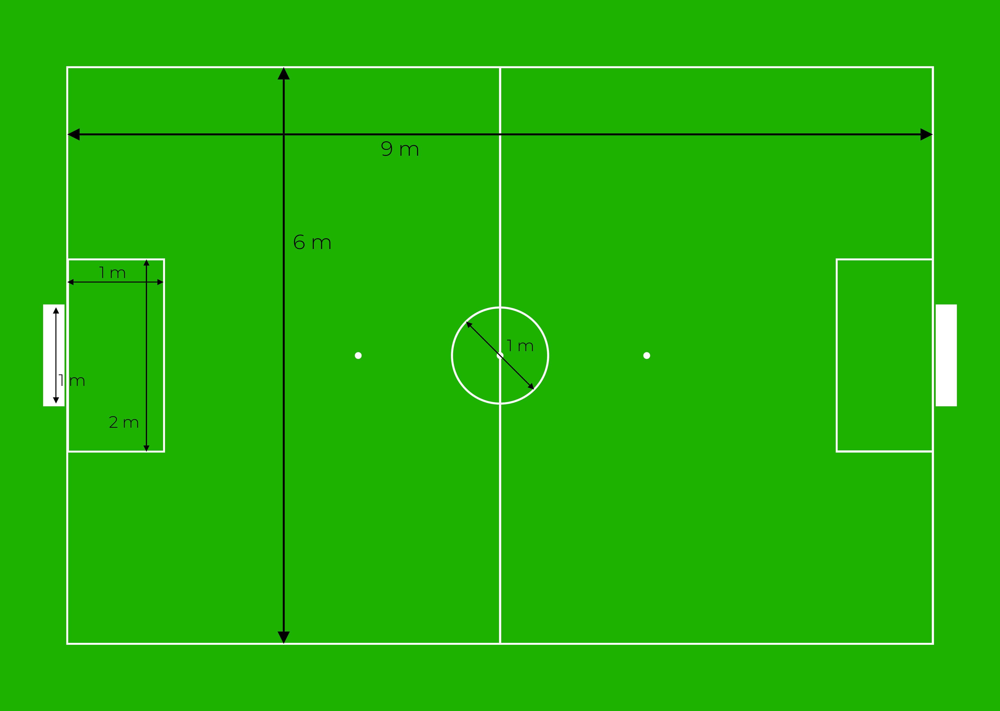

# Reglamento EDACup 2023

rev. 1

## Introducción

_EDACup_ es una competición robótica virtual organizada por capítulo de estudiantes IEEE del Instituto Tecnológico de Buenos Aires.

## Regla 1: El campo de juego

<figcaption align="center">El campo de juego</figcaption>

El _campo de juego_ es rectangular, de 9 m de largo por 6 m de ancho, de color verde. Se encuentra marcado con líneas continuas blancas, de 0.01 metros de ancho.

Las dos líneas de demarcación más largas se denominan _líneas de banda_. Las dos más cortas son las _líneas de meta_.

El campo de juego está dividido en dos mitades por una _línea central_ que une los puntos medios de las dos líneas de banda.

El _punto central_ del campo de juego se encuentra en el punto medio de la _línea central_, alrededor del cual se encuentra una circunferencia de diámetro 1 m.

Junto a cada línea de meta se encuentra un _arco_, centrado respecto de la respectiva línea de meta. Los arcos constan de dos paredes verticales, una pared posterior de 0.16 m de alto, y un techo. El espacio interior entre las paredes laterales es de 1 m, y su profundidad, de 0.18 m. Las paredes y el techo tienen un grosor de 0.02 m y tocan la línea de meta, sin invadirla.

Frente a cada arco se encuentra un _área de defensa_ rectangular. Sus lados mayores miden 2 m de largo y son paralelos a la líneas de meta; sus lados menores miden 1 m de largo y son paralelos a las líneas de banda.

Cada arco posee un _punto penal_ ubicado a 6 m frente al centro de cada arco.

El _área técnica_ se extiende 1 m fuera de las líneas de demarcación.

## Regla 2. La pelota

La _pelota_ es una pelota de golf estándar de color naranja. Pesa 0.046 kg y posee un diámetro de 0.043 m.

## Regla 3. Los equipos

Un _partido_ es disputado por dos equipos, cada uno de ellos con un máximo de seis EDABots.

Cada equipo debe designar un _representante de equipo_.

Todos los robots deben estar claramente identificados para que el árbitro pueda reconocerlos durante el partido. La identificación se realiza a través de la pantalla LCD de cada EDABot, y consta del logo del equipo y del número del robot. La tipografía del número debe ser de al menos 8 píxeles de alto. La identificación no debe contener imágenes de carácter político, religioso o personal.

El _software de control_ de los robots debe ser totalmente autónomo: sólo puede acceder a la información de los propios robots, a la posición/velocidad/orientación y aceleración angular de los demás robots y de la pelota, y a los eventos provistos por el _software de control del juego_. El incumplimiento de esta regla es considerado conducta antideportiva.

El software de control de los robots recibe mensajes del software de simulación del juego a fin de conocer el estado del juego (ver anexo).

Durante un partido no es posible modificar el software de control de los robots. Entre partidos es posible hacer ajustes y correcciones.

## Regla 4. El árbitro

El _árbitro_ toma sus decisiones según su criterio de acuerdo a las reglas y al espíritu del juego. Las decisiones del árbitro se basan en la opinión de este último, quien tiene el poder discrecional para tomar las decisiones adecuadas dentro del marco de las reglas de juego.

Las decisiones arbitrales sobre hechos y acciones sucedidos durante el encuentro, incluyendo dar por válido un gol o el resultado del partido, son irrevocables. Las decisiones del árbitro y del resto de miembros del equipo arbitral deberán respetarse en todo momento.

El árbitro es asistido por el árbitro automático del software de simulación del juego. El árbitro puede revocar cualquier decisión del árbitro automático.

Los representantes de equipo son los únicos miembros de los equipos autorizados a hablar con el árbitro.

Las facultades y obligaciones del árbitro son:

- hacer cumplir las reglas de juego;
- dirigir el partido en colaboración con los otros miembros del equipo arbitral;
- tomar nota de las incidencias del partido;
- supervisar o dar la señal para la reanudación del partido.

El equipamiento del árbitro incluye:

- un silbato;
- tarjetas rojas y amarillas.

## Regla 5. El árbitro asistente

La función del _árbitro asistente_ es apoyar al árbitro.

Los miembros de los equipos no pueden hablar con el árbitro asistente.

Las facultades y obligaciones del árbitro asistente son:

- indicar cualquier mala conducta o incidente no visto por el árbitro;
- discutir situaciones poco claras con el árbitro.

## Regla 6. El operador de juego

El _operador de juego_ es el intermediario entre el árbitro, el software de simulación del juego y el software de control de los robots de cada equipo.

Los miembros de los equipos no pueden hablar con el operador de juego.

Las facultades y obligaciones del operador de juego son:

- configurar el juego antes del comienzo del partido;
- introducir las órdenes del árbitro en el software de simulación de juego;
- supervisar el registro de eventos del partido en busca de eventos que requieran atención, y notificarlos al árbitro.

## Regla 7. La duración del partido

El partido se desarrolla en dos períodos de 300 segundos cada uno.

En caso de empate, se añaden dos tiempos suplementarios de 150 segundos cada uno.

En caso de reiterado empate, se añaden tandas de cinco penales por tiempo indefinido.

El cronómetro del partido corre mientras los robots pueden manipular la pelota; el cronómetro no corre antes del saque inicial, tiro libre, tiro penal, o cuando el juego está detenido.

Cuando un equipo marca 10 goles, gana automáticamente, independientemente de la fase en que se encuentra el juego.

## Regla 8. Inicio del juego

El juego se inicia con un _saque inicial_ al comienzo de cada uno de los dos periodos de un partido, de los tiempos suplementarios y después de marcar un gol.

Procedimiento:

- Antes de empezar el partido, el árbitro lanza una moneda en presencia de los representantes de los equipos. El equipo ganador elige, o bien, la mitad del campo desde la que ataca en el primer tiempo, o bien, ejecuta el saque inicial.
- El equipo que elige el campo para el primer tiempo ejecuta el saque inicial para el segundo tiempo.
- En el segundo tiempo, los equipos cambian de campo y atacan al arco opuesto.
- Cuando un equipo marca un gol, el equipo adversario reanuda el juego con un saque inicial.

En el saque inicial:

- el árbitro da la orden de saque inicial;
- la pelota se coloca en el punto central y se emite el mensaje `preKickOff`;
- todos los robots, a excepción del que ejecuta el saque, deben encontrarse en su propia mitad del campo de juego;
- los robots adversarios al equipo que efectúa el saque deben ubicarse fuera del círculo central hasta que la pelota entre en juego; 
- se emite el mensaje `kickOff`;
- es posible marcar un gol directo al equipo adversario desde el saque inicial.

## Regla 9. Reanudación del juego

Para reanudar un juego interrumpido por una causa que no favorece a ningún equipo (por una causa externa, o porque ambos equipos están en falta), la pelota se coloca en la posición donde se produjo el último contacto válido de la pelota con un robot, y se emite el mensaje `continue`. Entonces ambos equipos pueden acercarse a la pelota y manipularla.

## Regla 10. Pelota en juego

La pelota está en juego a partir del momento en que:

- se emitió el mensaje `kickOff`, `freeKick` o `penaltyKick` y, además, la pelota recorrió una distancia de por lo menos 0.05 m o pasaron más de 10 s;
- se emitió el mensaje `continue`.

La pelota no está en juego cuando:

- se emitió el mensaje `preKickOff`, `preFreeKick`, `prePenaltyKick` o `pause`; a partir de entonces los robots disponen de 2 s para reducir su velocidad a menos de 1.5 m/s y ubicarse a más de 0.5 m de la pelota.

## Regla 11. El resultado de un partido

Un gol se considera válido cuando la pelota atraviesa completamente la línea de meta entre las paredes y debajo del techo, siempre que:

- el equipo no exceda el número de robots permitidos en el momento en que la pelota ingresa al arco.
- la altura de la pelota no exceda 0.15 m después del último contacto con un robot del equipo.
- el equipo no cometa ninguna falta desde el último contacto con un robot del equipo.

Cuando se produce un gol se emite el mensaje `pause`.

## Regla 12. Faltas y conducta incorrecta

Los miembros de los equipos deben ser respetuosos con todos los involucrados en el juego. Se considera _conducta antideportiva_ insultar o fastidiar al equipo adversario, al árbitro, al árbitro asistente, al operador de juego, o no obedecer las órdenes del árbitro. La conducta antideportiva puede ser penalizada con una tarjeta amarilla, una tarjeta roja, con un forfait o con la descalificación del equipo.

Si el juego no progresa por 10 segundos con la pelota en juego, el árbitro detiene el juego, lo reanuda al poco tiempo, y se emite el mensaje `continue`.

Cada falta cometida es contabilizada por un contador de faltas propio a cada equipo, que aumenta en uno por cada falta cometida. Cada tercer aumento del contador de faltas produce la presentación de una tarjeta amarilla.

Las siguientes faltas detienen el juego, que se reanuda con un tiro libre para el equipo adversario:

- __Doble toque inicial__. Cuando la pelota entra en juego después de un saque inicial o tiro libre, el primer robot que toca la pelota no puede tocarla una segunda vez, antes de que la toque otro robot o el juego haya sido detenido.
- __Cruzar las líneas de banda__. Un robot mueve la pelota fuera de una de las líneas de banda.
- __Cruzar la línea de meta propia__. Cuando un robot mueve la pelota más allá de la línea de meta del equipo propio, la pelota se ubica a 0.2 m de la línea de banda más cercana y a 0.2 m de la línea de meta.
- __Cruzar la línea de meta del adversario__. Cuando un robot mueve la pelota mas allá de la línea de meta del equipo adversario, la pelota se ubica a 0.2 m de la línea de banda más cercana y a 1 m de la línea de meta.
- __Empujar__. Un robot empuja a un robot adversario cuando ambos tienen contacto con la pelota o entre sí, y el robot ejerce una fuerza sobre el robot adversario, moviendo el punto entre ambos robots hacia el robot adversario.
- __Rodear la pelota__. Impedir al equipo adversario el acceso a la pelota.
- __Robot en el área de defensa del equipo adversario__. Cuando la pelota no está en juego, y en los tiros libres antes de que la pelota vuelve a estar en juego, ningún robot debe tocar o encontrarse en el área de defensa adversaria. Hay un período de gracia de 2 s para que los robots se alejen del área de defensa adversaria.
- __Múltiples defensores__. Sólo puede haber un robot parcial o totalmente dentro del área de defensa propia. Infringir esta regla puede considerarse conducta antideportiva. Si dos robots de un mismo equipo están parcial o totalmente dentro del área de defensa propia y uno de ellos toca la pelota, el juego se detiene y se concede un tiro penal al equipo adversario.
- __Dribbling excesivo__. Los robots no deben empujar la pelota con el dribbler por más de 1 m, medido linealmente desde el lugar en que comenzó el contacto con la pelota. Un robot deja de usar el dribbler cuando puede observarse un espacio entre la pelota y el robot.

Las siguientes faltas no detienen el juego:

- __Tocar la pelota en el área de defensa del adversario__. La pelota no debe tocarse cuando un robot se encuentra parcial o totalmente en el área de defensa del equipo adversario.
- __Velocidad de la pelota__. La velocidad de la pelota no debe exceder 6.5 m/s en el espacio tridimensional.
- __Choque__. Se proyectan las velocidades de ambos robots sobre la recta que los une entre sí. Si el módulo de la diferencia de velocidades proyectadas supera 1.5 m/s, el robot más rápido comete una falta.

Las siguientes faltas pueden ocurrir cuando la pelota no está en juego:

- __Robot demasiado cerca de la pelota__. Cuando el juego está detenido, todos los robots deben estar a más de 0.5 m de la pelota.
- __Adversario demasiado cerca de la pelota__. Antes del saque inicial o tiro libre, los robots adversarios deben permanecer a más de 0.5 m de la pelota; los robots del equipo propio pueden acercarse más. En los tiros penales, todos los robots, salvo el defensor y el atacante, deben permanecer al menos 1 m detrás de la pelota.
- __Exceso de velocidad__. Cuando la pelota no está en juego, los robots no deben moverse a más de 1.5 m/s.

En todas las faltas, se considera un período de gracia de 2 s para la próxima falta del mismo tipo.

Cuando se presenta una _tarjeta amarilla_, se emite el mensaje `removeRobot` y el equipo en falta dispone de 10 s para retirar un robot a su posición inicial en el área técnica, lo cual disminuye el número de robots permitidos en el campo de juego por uno.

Al cabo de 120 s de tiempo de juego la tarjeta amarilla expira y, en cuanto se da la próxima oportunidad, se emite el mensaje `addRobot` que autoriza al equipo añadir un robot al campo de juego.

Si la tarjeta amarilla se presenta por conducta antideportiva, el árbitro tiene la potestad de detener el partido; en este caso el juego continúa con un tiro libre.

Una _tarjeta roja_ es similar a una tarjeta amarilla, pero no expira.

Si un equipo posee dos tarjetas amarillas aún no expiradas, la tercera tarjeta amarilla se convierte en roja.

Un partido termina en _forfait_ cuando un equipo se queda sin robots por tarjetas amarillas o rojas; en este caso el partido finaliza con el puntaje 10:0 a favor del equipo que todavía tiene robots en juego.

## Regla 13. El tiro libre

Se concede un tiro libre al equipo adversario de un robot responsable de una infracción.

A excepción de los cruces de la línea de meta o de banda, los tiros libres se ejecutan en el lugar en el que se produjo la infracción. Si dicho lugar se encuentra a una distancia menor a 0.2 m a las líneas de demarcación, o a menos de 1 m de las áreas de defensa, la pelota se coloca en la posición válida más cercana.

En el tiro libre:

- el árbitro da la orden de tiro libre;
- la pelota se coloca en el lugar correspondiente y se emite el mensaje `preFreeKick`;
- todos los robots del equipo responsable de la infracción deben ubicarse a más de 0.5 m de la pelota;
- se emite el mensaje `freeKick`;
- es posible marcar un gol directo al equipo adversario desde el tiro libre.

## Regla 14. El tiro penal

Procedimiento:

* el árbitro da la orden de tiro penal;
* la pelota se coloca en el punto penal correspondiente al arco del equipo defensor y se emite el mensaje `prePenaltyKick`;
* un robot defensor se mueve a la línea de meta para defender su arco;
* un robot atacante puede acercarse a la pelota, sin tocarla;
* todos los demás robots deben permanecer al menos 1 m detrás de la pelota;
* se emite el mensaje `penaltyKick`;
* el robot atacante debe mover la pelota en dirección al arco;
* si la pelota sigue en juego después de 10 s, el juego se detiene.

Se concede el gol si se cumple la regla 11, o si el equipo defensor comete falta.

## Anexo

Lista de mensajes MQTT del software de simulación del juego:

| Tópico | Descripción | Payload |
| - | - | - |
| ball/motion/state | Posición 3D [m], velocidad 3D [m/s], rotación 3D (ángulos eulerianos) [°], velocidad angular 3D [°/s] | `float32 * 12` |
| edacup/preKickOff | El equipo (1 o 2) está por realizar un saque inicial. | `uint8` |
| edacup/kickOff | El equipo (1 o 2) debe realizar el saque inicial. | `uint8` |
| edacup/preFreeKick | El equipo (1 o 2) está por realizar un tiro libre. | `uint8` |
| edacup/freeKick | El equipo (1 o 2) debe realizar el tiro libre. | `uint8` |
| edacup/prePenaltyKick | El equipo (1 o 2) está por realizar un tiro penal. | `uint8` |
| edacup/penaltyKick | El equipo (1 o 2) debe realizar el tiro penal. | `uint8` |
| edacup/pause | El juego se detuvo. | - |
| edacup/continue | El juego se reanuda. | - |
| edacup/removeRobot | El equipo (1 o 2) debe retirar un robot. | `uint8` |
| edacup/addRobot | El equipo (1 o 2) puede incorporar un robot. | `uint8` |
