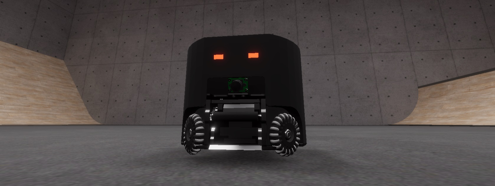
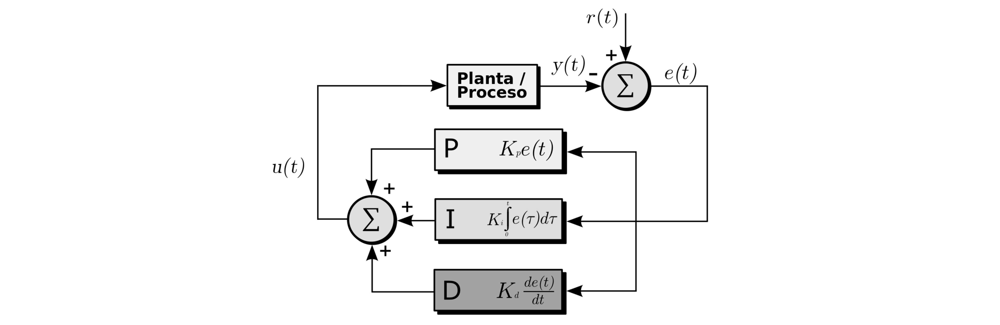

# Especificaciones EDABot 2023

Versión 1



## Resumen

EDABot es un robot virtual móvil diseñado para deportes robóticos con tres grados de libertad de movimiento (dos de traslación y uno de rotación). Está equipado con cuatro ruedas omniwheel, controlador PID de posición y orientación, un dribbler para controlar la pelota, un kicker para disparar la pelota hacia adelante, un chipper para disparar la pelota a 45°, una pantalla LCD en la parte superior y dos LEDs en los ojos.

| Ítem                            | Descripción                                         |
|---------------------------------|-----------------------------------------------------|
| Dimensiones                     | Altura: 140 mm, diámetro: 180 mm                     |
| Peso                            | 2.6 kg                                              |
| Peso de cada rueda              | 70 g                                                |
| Centro de masa                  | 35 mm desde el piso                                 |
| Capacidad de la batería         | 28.8 Wh                                             |
| Motores de las ruedas           | maxon EC 45 flat ⌀ 42.8 mm, brushless, 70 Watt      |
| Gear ratio de las ruedas        | 1:1 (directo)                                       |
| Motor del dribbler              | maxon ECX SPEED 13 L ⌀ 13 mm, brushless, BLDC motor |
| Gear ratio del dribbler         | 1:1                                                 |
| Control de los motores          | Por tensión/por corriente                           |
| Corriente máxima de los motores | 10 A                                                |

## Ruedas

Las cuatro ruedas del EDABot están ubicadas a 90° entre sí, con un ángulo de ±45° respecto al frente del robot. Se numeran del 1 al 4 según el siguiente esquema (vista superior):


Ten en cuenta que una tensión o corriente positiva causará que la rueda gire en sentido horario (desde el frente de cada rueda). Además, es importante que no excedas la temperatura máxima que los motores soportan, ya que de lo contrario podrían quemarse.

## Controlador PID de posición y orientación

El [controlador PID](https://es.wikipedia.org/wiki/Controlador_PID) de posición y orientación simplifica en gran medida el manejo de los robots. Te recomendamos encarecidamente utilizarlo en lugar de controlar los motores por tensión o corriente.

El funcionamiento del controlador es sencillo: simplemente le indicas al robot la posición y orientación que deseas (coordenadas `x` y `z`, y giro respecto al eje `y`) y el robot trabajará para alcanzar esa posición y orientación, independientemente de dónde se encuentre.



El controlador PID calcula continuamente la diferencia entre la posición y orientación actual del robot y la posición y orientación deseada (conocida como "setpoint"), y ajusta los motores del robot para minimizar esta diferencia utilizando tres parámetros (proporcional, integral y derivativo), que puedes definir. Al ajustar estos parámetros, ten en cuenta que existe un compromiso entre la velocidad de respuesta (cuán rápido llega a destino) y las oscilaciones (cuánto oscila alrededor del setpoint cuando llegó).

También debes prestar atención a la temperatura de los motores porque de lo contrario podrían quemarse. Para evitar esto, controla cuidadosamente cuán lejos colocas el "setpoint" respecto del valor actual, ajusta los parámetros del PID y monitorea la temperatura de los motores.

## Dribbler

El dribbler es un cilindro accionado por un motor que ayuda a mantener el control de la pelota frente al robot. Si aplicas una tensión o corriente positiva, la pelota se moverá en dirección al robot.

## Kicker y chipper

El kicker y el chipper son [solenoides](https://es.wikipedia.org/wiki/Solenoide) que se activan mediante un breve pulso de corriente. La duración de este pulso determina la potencia del disparo.

Para realizar el disparo, se descarga un [capacitor](https://es.wikipedia.org/wiki/Condensador_el%C3%A9ctrico) de alta tensión que debe cargarse previamente. Este capacitor es compartido por el kicker y el chipper.

La tensión máxima de carga es de 300 V. El robot tiene un circuito de protección que limita la tensión del capacitor a 250 V.

## LEDs de los ojos

Cada LED es controlado por tres bytes en formato R8G8B8.

## Protocolo de comunicaciones

EDABot utiliza el protocolo de comunicaciones [MQTT](https://en-m-wikipedia-org.translate.goog/wiki/MQTT?_x_tr_sl=auto&_x_tr_tl=es&_x_tr_hl=es&_x_tr_pto=wapp) para enviar y recibir comandos y estados.

Para conectarte al simulador de juego, utiliza los siguientes datos:

```
hostname: localhost
port: 1883
username: robot1 o robot2
password: robot1 o robot2
```

Cada robot se identifica mediante un identificador único `[robotId]`, que se utiliza como el primer nivel del tópico MQTT.

Los tópicos de lectura (a los que te puedes [suscribir](https://en-m-wikipedia-org.translate.goog/wiki/Publish%E2%80%93subscribe_pattern?_x_tr_sl=auto&_x_tr_tl=es&_x_tr_hl=es&_x_tr_pto=wapp)) tienen tres niveles y se actualizan a una frecuencia de 10 Hz (es decir, diez veces por segundo).

Los tópicos de escritura (a los que puedes [publicar](https://en-m-wikipedia-org.translate.goog/wiki/Publish%E2%80%93subscribe_pattern?_x_tr_sl=auto&_x_tr_tl=es&_x_tr_hl=es&_x_tr_pto=wapp)) tienen cuatro niveles, siendo el último nivel `set` o `cmd`.

A continuación te presentamos una tabla con los tópicos MQTT, su descripción, su carga útil y el nivel de acceso:

| Tópico | Descripción | Payload | Acceso |
| - | - | - | - |
| `[robotId]/motion/state` | Incluye la posición 3D \[m\], velocidad 3D \[m/s\], rotación 3D (ángulos eulerianos) \[°\] y velocidad angular 3D \[°/s\] del robot | `float32 * 12` | Lectura |
| `[robotId]/power/state` | Incluye el consumo eléctrico total \[W\], el nivel de batería entre 0 (vacío) y 1 (lleno), y la tensión del capacitor del kicker/chipper \[V\] | `float32 * 3` | Lectura |
| `[robotId]/motors/state` | Incluye, para cada motor (ruedas 1-4 y dribbler 5): la tensión del motor `[N]` \[V\], la corriente del motor `[N]` \[A\], los RPM del motor `[N]` \[60/s\] y la temperatura de chassis del motor `[N]` \[°C\] | `float32 * 20` | Lectura |
| `[robotId]/motor[N]/voltage/set` | Controla el motor `[N]` (ruedas 1-4 y dribbler 5) mediante tensión \[V\] | `float32` | Escritura |
| `[robotId]/motor[N]/current/set` | Controla el motor `[N]` (ruedas 1-4 y dribbler 5) mediante corriente \[A\] | `float32` | Escritura |
| `[robotId]/pid/setpoint/set` | Establece la posición `x`, `z` \[m\] y rotación `r` \[°\] del controlador PID | `float32 * 3` | Escritura |
| `[robotId]/pid/parameters/set` | Establece los parámetros `P`, `I`, `D` del controlador PID de posición, y los parámetros `P`, `I`, `D` del controlador PID de orientación (por defecto: 20, 0, 6, 0.1, 0, 0.005) | `float32 * 6` | Escritura |
| `[robotId]/kicker/chargeVoltage/set` | Establece la tensión de carga del capacitor \[V\] | `float32` | Escritura |
| `[robotId]/kicker/kick/cmd` | Dispara el kicker con una potencia entre 0 y 1 | `float32` | Escritura |
| `[robotId]/kicker/chip/cmd` | Dispara el chipper con una potencia entre 0 y 1 | `float32` | Escritura |
| `[robotId]/display/eyes/set` | Establece el color RGB del ojo izquierdo y derecho | `uint8 * 6` | Escritura |
